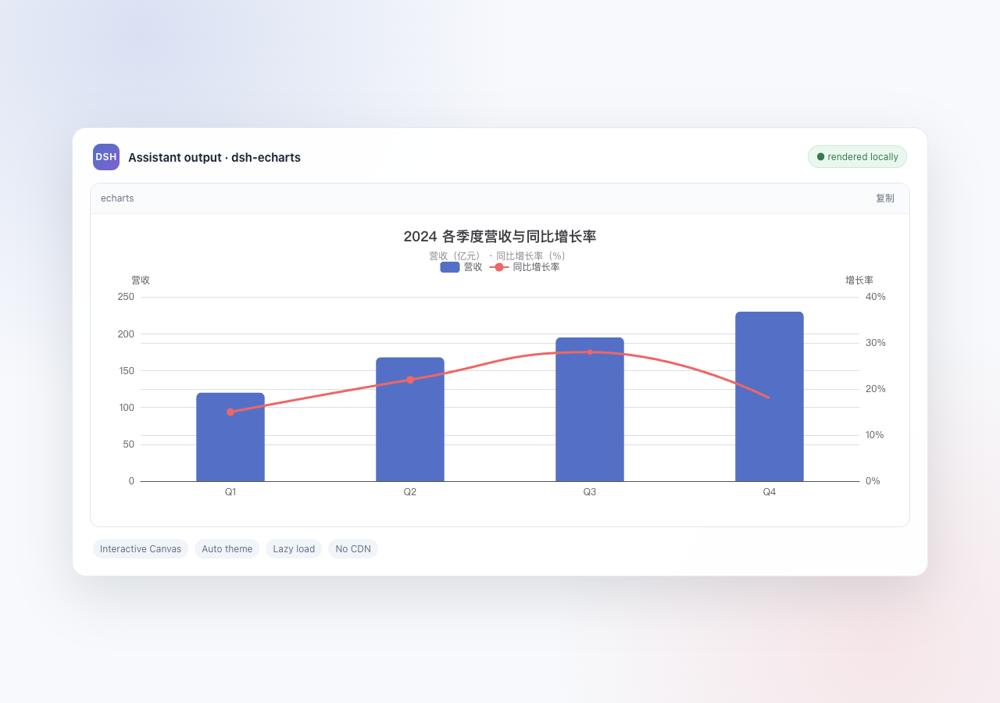
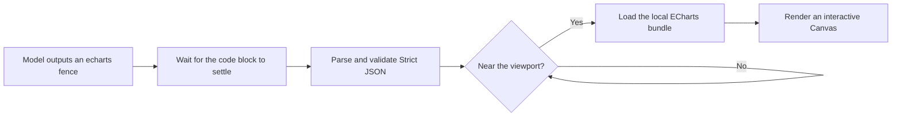

# dsh-echarts

<p align="center">
  <strong>Turn DSH answers into interactive charts, not just code blocks.</strong>
</p>

<p align="center">
  The model outputs Strict JSON in an <code>echarts</code> fence. The plugin automatically renders it as an Apache ECharts Canvas.
</p>

<p align="center">
  <code>DSH Web</code> · <code>Apache ECharts 6</code> · <code>Lazy load</code> · <code>No CDN</code> · <code>MIT</code>
</p>

<p align="center">
  
</p>

<p align="center"><sub>Real Canvas output: quarterly revenue bars with a year-over-year growth line</sub></p>

[中文](./README.md)

## Why dsh-echarts?

- **No extra Tool call** — a normal assistant response containing an `echarts` fence is enough.
- **Real interaction** — use ECharts tooltips, legend filtering, zooming, brushing, and image export.
- **Loaded on demand** — ECharts loads only when a chart approaches the viewport, while multiple charts initialize serially.
- **Native DSH feel** — charts follow the DSH light/dark theme and resize with their containers.
- **Local and controlled** — the bundle is served by the plugin with no CDN dependency, and model output is treated as untrusted input.
- **Source-preserving errors** — invalid JSON or render failures leave the original code visible with a copyable message.

It works especially well for analysis results, operating reports, experiment comparisons, trends, and any conversation where seeing the data is better than reading the configuration.

## Quick start

### 1. Install

```bash
npx @deepseek-ai/dsh plugin --profile web add github:sheny-bio/dsh-echarts
```

### 2. Restart DSH Web

```bash
npx @deepseek-ai/dsh web
```

If `dsh` is installed globally, use `dsh` in place of `npx @deepseek-ai/dsh`.

### 3. Ask for a chart

Try this prompt:

> Visualize the quarterly data as a dual-axis bar and line chart. End with one lowercase `echarts` code fence containing Strict JSON only. Do not use comments, functions, or expressions.

Once the response contains a complete `echarts` fence, the plugin renders it automatically—there is no Run button.

## Examples

### Dual-axis bar and line chart

This is the option used by the preview image above. Paste it into a DSH conversation to try it:

````markdown
```echarts
{
  "title": {
    "text": "2024 Quarterly Revenue and YoY Growth",
    "subtext": "Revenue (CNY 100M) · YoY growth (%)",
    "left": "center"
  },
  "color": ["#5470c6", "#ee6666"],
  "tooltip": {
    "trigger": "axis",
    "axisPointer": { "type": "cross" }
  },
  "legend": {
    "data": ["Revenue", "YoY growth"],
    "top": 56
  },
  "grid": {
    "left": 64,
    "right": 64,
    "top": 104,
    "bottom": 48
  },
  "xAxis": {
    "type": "category",
    "data": ["Q1", "Q2", "Q3", "Q4"]
  },
  "yAxis": [
    {
      "type": "value",
      "name": "Revenue",
      "axisLabel": { "formatter": "{value}" }
    },
    {
      "type": "value",
      "name": "Growth",
      "axisLabel": { "formatter": "{value}%" }
    }
  ],
  "series": [
    {
      "name": "Revenue",
      "type": "bar",
      "barWidth": "38%",
      "itemStyle": { "borderRadius": [6, 6, 0, 0] },
      "data": [120, 168, 195, 230]
    },
    {
      "name": "YoY growth",
      "type": "line",
      "yAxisIndex": 1,
      "smooth": true,
      "symbolSize": 8,
      "lineStyle": { "width": 3 },
      "data": [15, 22, 28, 18]
    }
  ]
}
```
````

### Donut chart

````markdown
```echarts
{
  "title": { "text": "Traffic sources", "left": "center" },
  "tooltip": { "trigger": "item" },
  "legend": { "bottom": 0 },
  "series": [
    {
      "name": "Source",
      "type": "pie",
      "radius": ["42%", "68%"],
      "avoidLabelOverlap": true,
      "itemStyle": {
        "borderRadius": 6,
        "borderColor": "#fff",
        "borderWidth": 2
      },
      "label": { "formatter": "{b}: {d}%" },
      "data": [
        { "value": 1048, "name": "Search" },
        { "value": 735, "name": "Direct" },
        { "value": 580, "name": "Email" },
        { "value": 484, "name": "Referral" }
      ]
    }
  ]
}
```
````

Bar, line, pie, scatter, radar, gauge, heatmap, Sankey, and many other charts work the same way, as long as the option can be represented as pure JSON.

## How it works



The plugin only processes blocks whose infostring is **exactly lowercase `echarts`**. Rendering always waits until DSH marks the code block as settled, avoiding repeated chart destruction and recreation during streaming.

## Input contract

| Rule | Valid | Common mistake |
| --- | --- | --- |
| Fence tag | lowercase `echarts` | `ECharts` or `json` |
| Content | Strict JSON object | JSON5, comments, trailing commas |
| Keys and strings | Double quoted | Single quotes or bare keys |
| Formatter | String template | JavaScript function |
| Outside the fence | Normal prose is fine | Putting stray text such as `</br>` inside the JSON |

JavaScript functions, expressions, `renderItem`, and event callbacks are unsupported. String formatters work normally.

## Configuration

Default patch:

```yaml
- insert:
    - id: echarts
      name: '@dsh-external/dsh-echarts'
      config:
        theme: auto
        height: 400
        maxTextSize: 200000
        maxOptionNodes: 100000
```

| Setting | Default | Meaning |
| --- | ---: | --- |
| `theme` | `auto` | `auto`, `light`, or `dark`; auto follows DSH Web |
| `height` | `400` | Chart height, 200–1200 CSS pixels |
| `maxTextSize` | `200000` | UTF-8 byte limit for one fence |
| `maxOptionNodes` | `100000` | Recursive JSON value limit for one option |

Canvas is the fixed renderer in the current release.

## Security and privacy

AI output is always treated as untrusted input:

- The plugin only calls `JSON.parse()`—never `eval()` or `new Function()`—and never binds model-provided event handlers.
- Prototype-pollution keys, options deeper than 64 levels, external/data images, `image://` symbols, title navigation, and visible `toolbox.dataView` are rejected.
- Tooltips are forced to `renderMode: richText`, keeping model content out of HTML tooltips.
- Errors are inserted with `textContent`, and the original `<pre>` is restored after failure.
- ECharts is served from the plugin dependency, not a CDN or a model-provided URL.

## Troubleshooting

| Symptom | What to check |
| --- | --- |
| The fence remains source code | Use the exact lowercase `echarts` tag and wait for the response to finish |
| A JSON error is shown | Remove comments, trailing commas, and extra in-fence text; double quote every key |
| Nothing changes after installation | Fully restart `dsh web`, then refresh the page |
| A chart farther down the page has not rendered | This is lazy loading; scroll near the chart |
| Need to confirm the plugin is loaded | Open `http://127.0.0.1:3080/echarts-dist/config.json`; it should return the plugin config |

If pnpm blocks the Git dependency's `prepare` script, add `@dsh-external/dsh-echarts` to `allowBuilds` in the Web profile's `pnpm-workspace.yaml`, then retry.

## Local development

```bash
npm install
npm run check
npm test
npm run build
npx @deepseek-ai/dsh plugin --profile web add .
npx @deepseek-ai/dsh web
```

With the plugin installed in a running DSH Web instance, run the Playwright E2E test with:

```bash
npx playwright install chromium
DSH_WEB_BASE=http://127.0.0.1:3080 npm run test:e2e
```

The default `npm test` does not start a browser or require a running DSH server.

Uninstall:

```bash
npx @deepseek-ai/dsh plugin --profile web remove @dsh-external/dsh-echarts
```

## Limitations

- The integration depends on DSH's `.md-code-block` class and readable infostring class segment.
- Streaming output renders only after DSH emits a settled block with the `echarts` infostring.
- Strict JSON cannot represent custom series, function formatters, or other JavaScript callbacks.
- Explicit colors in an option do not automatically adapt when the theme changes.

## Acknowledgements

The Host/Client structure and DOM lifecycle were informed by the MIT-licensed [dsh-mermaid](https://github.com/AKS1st/dsh-mermaid). See [NOTICE](./NOTICE).

## License

[MIT](./LICENSE)
