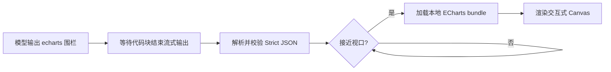

# dsh-echarts

<p align="center">
  <strong>让 DSH 的回答不止有代码，还能直接变成可交互图表。</strong>
</p>

<p align="center">
  模型只需输出一段 Strict JSON，插件便会把 <code>echarts</code> 代码围栏自动渲染为 Apache ECharts Canvas。
</p>

<p align="center">
  <code>DSH Web</code> · <code>Apache ECharts 6</code> · <code>Lazy load</code> · <code>No CDN</code> · <code>MIT</code>
</p>

<p align="center">
  
</p>

<p align="center"><sub>真实 Canvas 渲染效果：营收柱状图 + 同比增长率折线图</sub></p>

[English](./README.en.md)

## 为什么选择 dsh-echarts？

- **零额外 Tool 调用**：模型正常回复一个 `echarts` 围栏即可，图表由 Web UI 自动捕获。
- **保留完整交互**：tooltip、图例筛选、缩放、数据区域选择和导出图片等 ECharts 能力均可使用。
- **按需加载**：图表接近视口时才加载 ECharts，多图串行初始化，长对话也更轻量。
- **跟随 DSH 主题**：自动响应 light / dark 主题与容器尺寸变化。
- **本地且可控**：ECharts bundle 由插件本地提供，不依赖 CDN；模型输出按不可信输入校验。
- **失败不丢源码**：JSON 或渲染出错时保留原始代码，并显示可复制的错误信息。

适合数据分析结果、运营报表、实验对比、趋势展示，以及任何希望在对话中“直接看图”的场景。

## 30 秒上手

### 1. 安装插件

```bash
npx @deepseek-ai/dsh plugin --profile web add github:sheny-bio/dsh-echarts
```

### 2. 重启 DSH Web

```bash
npx @deepseek-ai/dsh web
```

已经全局安装 `dsh` 时，可将以上命令中的 `npx @deepseek-ai/dsh` 简写为 `dsh`。

### 3. 让模型输出图表

可以直接把下面这句话交给模型：

> 请把季度数据画成柱线双轴图。最终输出一个小写 `echarts` 代码围栏，围栏内只放 Strict JSON，不要使用注释、函数或表达式。

只要回答中出现完整的 `echarts` 围栏，插件就会自动渲染，无需点击运行按钮。

## 示例

### 柱线双轴图

下面的配置就是首页截图所使用的图表。复制到 DSH 对话中即可体验：

````markdown
```echarts
{
  "title": {
    "text": "2024 各季度营收与同比增长率",
    "subtext": "营收（亿元） · 同比增长率（%）",
    "left": "center"
  },
  "color": ["#5470c6", "#ee6666"],
  "tooltip": {
    "trigger": "axis",
    "axisPointer": { "type": "cross" }
  },
  "legend": {
    "data": ["营收", "同比增长率"],
    "top": 56
  },
  "grid": {
    "left": 64,
    "right": 64,
    "top": 104,
    "bottom": 48
  },
  "xAxis": {
    "type": "category",
    "data": ["Q1", "Q2", "Q3", "Q4"]
  },
  "yAxis": [
    {
      "type": "value",
      "name": "营收",
      "axisLabel": { "formatter": "{value} 亿" }
    },
    {
      "type": "value",
      "name": "增长率",
      "axisLabel": { "formatter": "{value}%" }
    }
  ],
  "series": [
    {
      "name": "营收",
      "type": "bar",
      "barWidth": "38%",
      "itemStyle": { "borderRadius": [6, 6, 0, 0] },
      "data": [120, 168, 195, 230]
    },
    {
      "name": "同比增长率",
      "type": "line",
      "yAxisIndex": 1,
      "smooth": true,
      "symbolSize": 8,
      "lineStyle": { "width": 3 },
      "data": [15, 22, 28, 18]
    }
  ]
}
```
````

### 环形占比图

````markdown
```echarts
{
  "title": { "text": "用户来源", "left": "center" },
  "tooltip": { "trigger": "item" },
  "legend": { "bottom": 0 },
  "series": [
    {
      "name": "来源",
      "type": "pie",
      "radius": ["42%", "68%"],
      "avoidLabelOverlap": true,
      "itemStyle": {
        "borderRadius": 6,
        "borderColor": "#fff",
        "borderWidth": 2
      },
      "label": { "formatter": "{b}: {d}%" },
      "data": [
        { "value": 1048, "name": "搜索引擎" },
        { "value": 735, "name": "直接访问" },
        { "value": 580, "name": "邮件营销" },
        { "value": 484, "name": "联盟广告" }
      ]
    }
  ]
}
```
````

柱状图、折线图、饼图、散点图、雷达图、仪表盘、热力图、桑基图等，都可以通过同样的方式展示；只要 option 能由纯 JSON 表达即可。

## 它是如何工作的？



插件只处理 infostring **严格等于小写 `echarts`** 的代码块，并且一定会等待代码块进入 settled 状态后再开始渲染。这样不会在流式输出尚未结束时反复销毁和重建图表。

## 输入约定

| 规则 | 正确示例 | 常见错误 |
| --- | --- | --- |
| 围栏标识 | <code>```echarts</code> | <code>```ECharts</code>、<code>```json</code> |
| 内容格式 | Strict JSON object | JSON5、尾逗号、注释 |
| 属性与字符串 | 使用双引号 | 单引号、未加引号的 key |
| formatter | 字符串模板 | JavaScript function |
| 围栏之外 | 可以正常写说明文字 | 把 `</br>` 等文本放进 JSON 内 |

不支持 JavaScript function、expression、`renderItem` 或事件回调。字符串 formatter 可以正常使用。

## 配置

插件的默认 patch：

```yaml
- insert:
    - id: echarts
      name: '@dsh-external/dsh-echarts'
      config:
        theme: auto
        height: 400
        maxTextSize: 200000
        maxOptionNodes: 100000
```

| 配置 | 默认值 | 说明 |
| --- | ---: | --- |
| `theme` | `auto` | `auto`、`light` 或 `dark`；`auto` 跟随 DSH Web |
| `height` | `400` | 图表高度，允许 200–1200 CSS pixels |
| `maxTextSize` | `200000` | 单个围栏的 UTF-8 bytes 上限 |
| `maxOptionNodes` | `100000` | 单个 option 递归访问的 JSON value 数量上限 |

Canvas renderer 为当前固定行为。

## 安全与隐私

AI 输出始终按不可信输入处理：

- 仅执行 `JSON.parse()`，不调用 `eval()`、`new Function()`，也不绑定模型提供的事件处理器。
- 拒绝 prototype-pollution key、超过 64 层的 option、外部/data image、`image://` symbol、title navigation 和可见的 `toolbox.dataView`。
- tooltip 被强制设置为 `renderMode: richText`，避免将模型内容放入 HTML tooltip。
- 错误内容只通过 `textContent` 展示；失败后恢复原始 `<pre>`。
- ECharts bundle 来自插件 dependency，不从 CDN 或模型指定 URL 加载。

## 常见问题

| 现象 | 检查方法 |
| --- | --- |
| 围栏一直显示为源码 | 确认标识是小写 `echarts`，并等待回答生成完成 |
| 显示 JSON 错误 | 删除注释、尾逗号和围栏内额外文字，确保所有 key 使用双引号 |
| 安装后没有变化 | 完全重启 `dsh web`，然后刷新页面 |
| 页面刚打开时未渲染远处图表 | 正常的 lazy load 行为；滚动到图表附近即可 |
| 想确认插件是否已加载 | 访问 `http://127.0.0.1:3080/echarts-dist/config.json`，应返回插件配置 |

若 pnpm 阻止 Git dependency 执行 `prepare`，请按报错提示将 `@dsh-external/dsh-echarts` 加入 Web profile 的 `pnpm-workspace.yaml` `allowBuilds` 后重试。

## 本地开发

```bash
npm install
npm run check
npm test
npm run build
npx @deepseek-ai/dsh plugin --profile web add .
npx @deepseek-ai/dsh web
```

连接已安装插件的 DSH Web 后，可运行 Playwright E2E：

```bash
npx playwright install chromium
DSH_WEB_BASE=http://127.0.0.1:3080 npm run test:e2e
```

默认 `npm test` 不启动浏览器，也不要求 DSH 服务。

卸载插件：

```bash
npx @deepseek-ai/dsh plugin --profile web remove @dsh-external/dsh-echarts
```

## 已知限制

- 依赖 DSH CodeBlock 的 `.md-code-block` 和 infostring class segment；上游 DOM 调整后需同步更新 selector。
- 流式阶段不渲染，只有 DSH 生成带 `echarts` infostring 的 settled block 后才渲染。
- Strict JSON 无法表达 ECharts custom series、function formatter 或其他 JavaScript callback。
- `theme: auto` 只能改变 ECharts 默认 theme；option 中硬编码的颜色不会自动转换。

## Acknowledgements

Host/Client 结构与 DOM lifecycle 参考了 MIT licensed [dsh-mermaid](https://github.com/AKS1st/dsh-mermaid)。详见 [NOTICE](./NOTICE)。

## License

[MIT](./LICENSE)
